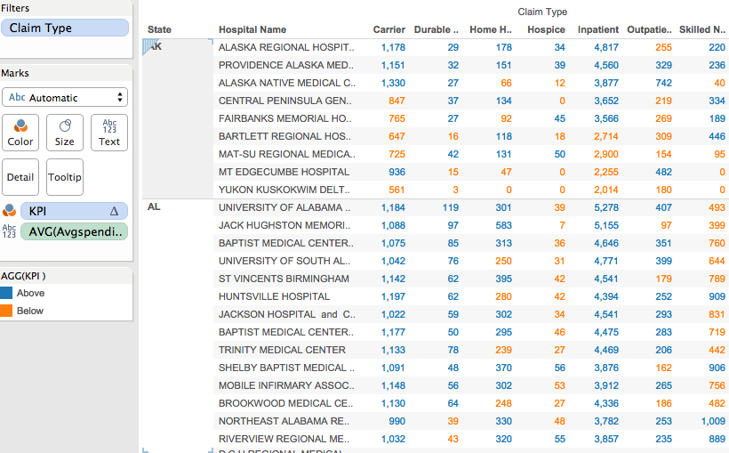
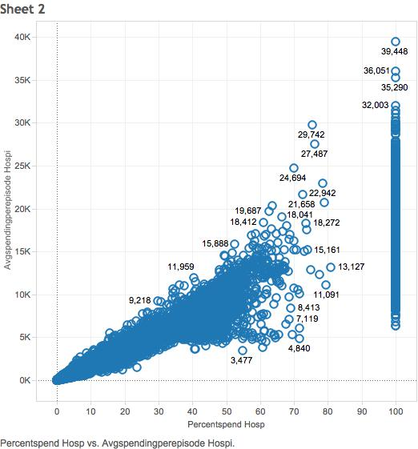
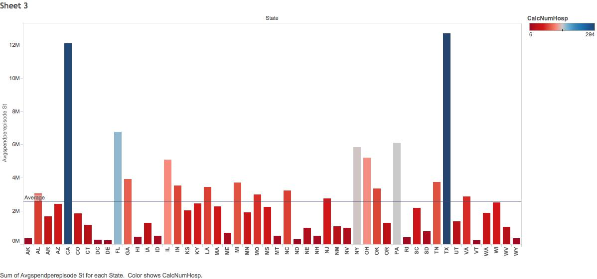
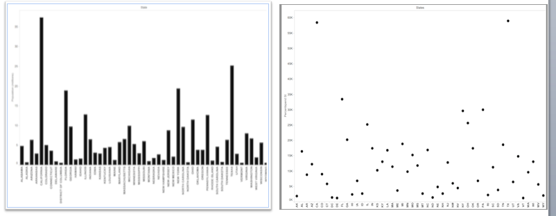

  
In this project, we were given the task to create three tableau graphs based on the dataset of our choice. We decided to explore a dataset that was based on Medicare Spending. Our data set included medicare spending in a national, state and hospital level which was great to compare spendings across the United States. Also, it showed the types of patient claims that were made in each hospital and the percent spend by each hospital, state and average national percent. 

#Project 4 Steps

##Step 1
The first step was to choose our data, which as explained in the introduction was the medicare data. Afterwards, we cleaned up the data using RStudio, created a reformatted csv file, a table in our SQL server and imported the data into our server. This enabled us to use our data in tableu. 

##Step 2
The first visualization we made was the Crosstab. In this visualization we wanted to observe the average spending of each hospital in every state, separating it by the different claim types that were made in each hospital. Therefore, we used as our column parameters, Claim Type and as our row paramenter Hospital Name and State. Since we wanted to analyize the spending, our text filter was the averagespending. This enabled us to see how much was each hospital spending per each claim time. Additionally, we wanted to compare the spendings of each hospital per claim type with the state average spending per claim type. Thus, we created a KPI that compared the average of the state spending in that specific claim type, with the spending that each hospital made per claim type.  This KPI allowed us to distinguish the hospitals in each state that were spending above or below the average spending per state per claim type. 





##Step 3
For our second visualization we created the scatter plot. Here, we wanted to see how much money did each hospital spend. Thus to figure this out we used as our x axis the percent spending of each hospital and as our y axis the average spending per hospital. The results did not surprise us, since generally the hospitals that on average spend the less amount of money have a lower percentage spending. However, there were a couple of hospitals that had a perecnt spending of 100% but low average expenditure amounts. This shows that there are hospitas that have more money to spend and thus might not spend their 100 percent, while there are hospitals that have a limited amount of money to spend and use it all up. In conclusion this scatter plot showed the reality that there are hospitals that have lots of money and not to much need to spend it while others that have little money and have the need to spend it all. 



##Step 4 
For our last visualization we created the barchart. In the bar chart we decided to display the amount of money that the hopsitals in each state spended and compare it to the other states. To do this we used States as our column parameter and SUM average spending per hospital as our row parameter. In consequence this gave us the total amount of money spend by each state. We then decided to put the reference line marking the average amount spend by all states. This enabled us to see which states were above and below average. Also, we decided to color the bar charts depending on the amount of hospitals that each state had; the more hospitals that each state had the closer the color got to a dark blue, and the less hospitals that each state had, the closer the color got to red. This also came as no surprise because the bar chart showed that the more hospitals each state had, the higher the spending. ok.



# Project 5 Steps

## Step 1
The first thing we did was to replicate the bar graph we had made using Tableau in Project 4. This graph can be found in the 03 R SQL Visualizations under the name barChart_inR.R.Before executing the code for the visualization you must crete the data fram which can be found in the 01 Data folder. 

```{r}
source("../01 Data/Medicare_summary.R", echo = TRUE)
source("../03 R SQL Visualizations/barChart_inR.R", echo = TRUE)
```

##Step 2
Afterwards we created the scatter plot graph. 
```{r}
source("../03 R SQL Visualizations/ScatterPlor_inR.R", echo = TRUE)
```

##Step 3
Finally we created the cross tab graph. 

##Step 4
We continued our project by creating a blend of two data sets. We decided to blend the dataset for Medicare data and GDP per State that we had used in the previous projects. In order to blend this data we needed to join the Medicare data with a States abbreviation data in order to get the States Abbreviation onto the medicare data and then blend it with the States' GDP data. 

Here's the data frames of such data. 
```{r}
source("../01 Data/gdp_summary.R", echo=TRUE)
source("../01 Data/statesAbbr_summary.R", echo=TRUE)
```


We began by doing this blend in R using SQL. You can find the blended data in the following documents followed by the visualization for it. 
```{r}
source("../01 Data/BlandedData.R", echo=TRUE)
source("../03 R SQL Visualization/BlendedVisualization.R", echo = TRUE)
```

##Step 5

We conducted the same blend using Tableau. You can find our data in the workbook called tableauworkbook2.twb in the 02 Tableau folder. The workbook has displayed the following graphs. As you can see this graphs are the same as the ones we reproduced in R. 


